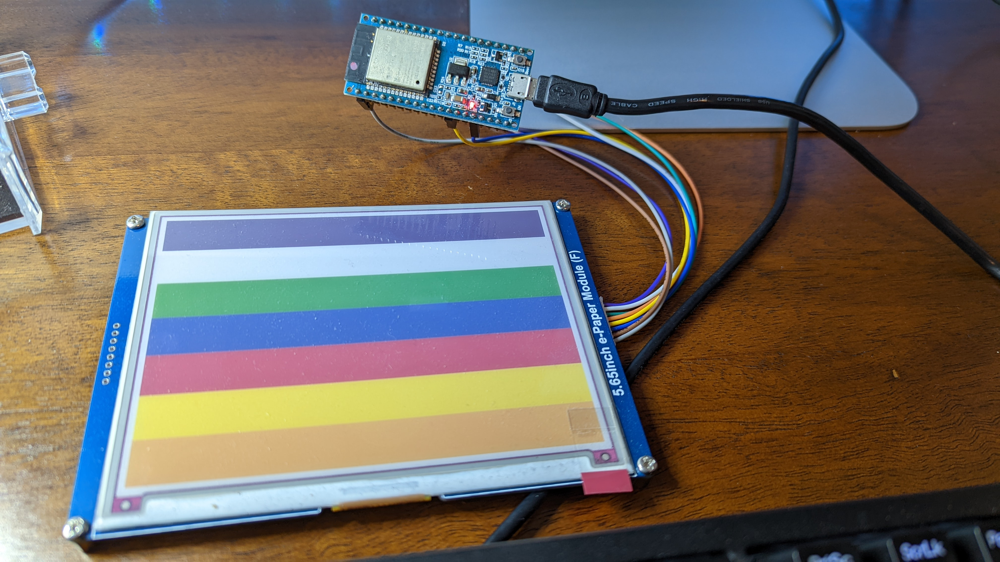

# epd_demo
Super simple example to push pixels to waveshare epd display

## Usage
See main/main/epd_demo.c for main usage

In short: feclare an `epd_t` and at least set the `.pins` to match where you want to
wire things up. The values there now work for me.

* `createEpd()` to set things up, this does all the esp32-specific setup, but
   doesnt talk to the display itself.
* `initEpd()` does a reset of the display and wait for it to be ready.

Then, each time you want to update the display:

* `epdBegin()` gets the display into a state where it is ready to receive pixel
  data
* `epdPush()` call repeatedly in a loop until exactly 600 * 448 / 2 = 134400
  bytes have been transferred. If you have the whole buffer at once then this
  might be just once, with all the data. I like to do it line-by line to keep
  peak memory requirments down. Or you can push to the display as each chunk of
  a download completes, etc.
  Note: you MUST send the correct number of bytes. I have no idea what happens
  if you send too little or to much.
* `epdEnd()` This finialises the display, beginning the update and waiting for
  it to happen. Note: this may take many seconds (say, upto 30)

## Data format
The buffer you push is 4-bits per pixel, packed tightly into neighbouring
nybbles of a byte. So for the a 600 * 448 display we send half that many bytes.

There are 7 colours allowed. These are presented below as well as their approximate RGB values (sampled from a photo of the display, taken under non-controlled lighting conditions).

| Index | Colour | RGB               | HTML    |
| ----- | -------| ----------------- | ------- |
| 0     | Black  | ( 12, 12, 14 )    | #0c0c0e |
| 1     | White  | ( 210, 210, 208 ) | #d2d2d0 |
| 2     | Green  | ( 30, 96, 31 )    | #1e601f |
| 3     | Blue   | ( 29, 30, 84 )    | #1d1e54 |
| 4     | Red    | ( 140, 27, 29 )   | #8c1b1d |
| 5     | Yellow | ( 211, 201, 61 )  | #d3c93d |
| 6     | Orange | ( 193, 113, 42 )  | #c1712a |

Internally, `epdClear()` just sends 0x11 bytes to make it all white.

## Example:

nice
